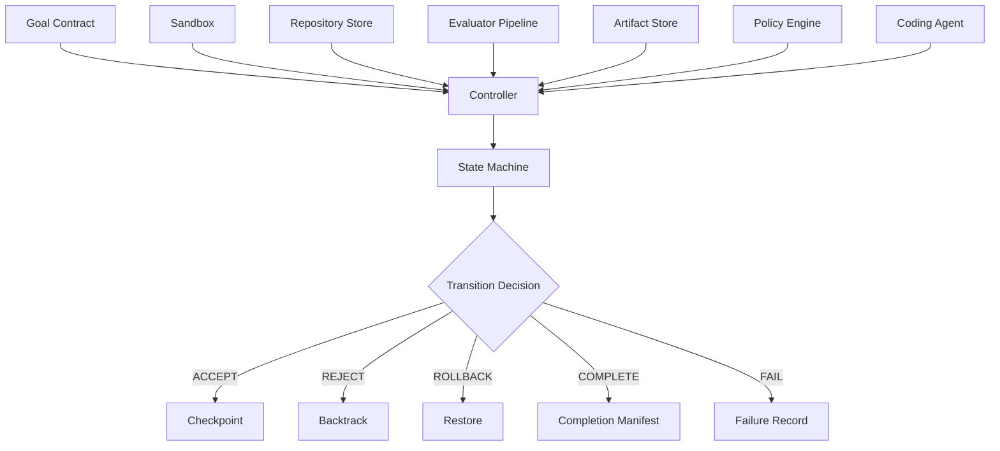

# constrained-agent-harness

**A reference harness for running coding agents as bounded, verifiable search over repository states.**

This repository implements the reference architecture described in
*"From Agentic Loops to Constrained Search: A Reference Architecture for
Verifiable Autonomous Software Engineering."*

## Problem

Conventional coding agents operate as indefinite conversations: a model
receives a task, iterates freely, and the human operator judges when the
result is acceptable. This approach conflates proposal with verification
and makes completion decisions opaque.

## Architectural Thesis

The system models coding as a **constrained transition process** over
repository states:

```
S_t --a_t--> S_t+1
```

The model proposes changes. The deterministic harness evaluates the resulting
state and decides whether to accept, reject, roll back, retry, branch, or
complete. The model never makes the authoritative completion decision.

## What This Repository Contains

- A **state machine controller** that enforces bounded execution
- **Goal contracts** — typed YAML specifications of task bounds
- **Policy engine** — path, command, and dependency enforcement
- **Sandbox** — Docker-isolated command execution
- **Git-backed repository store** — immutable checkpoints with rollback
- **Evaluator pipeline** — plugin-based quality and safety checks
- **Hidden verification** — protected tests invisible to the agent
- **Context reconstruction** — fresh-session context per iteration
- **Artifact store** — append-only hash chain evidence
- **4 experiment modes** for controlled comparison
- **Benchmark**: payment webhook idempotency

## What This Repository Does NOT Provide

- A general replacement for coding-agent products
- Distributed execution or Kubernetes orchestration
- Arbitrary shell access to the host
- Multi-tenant operation
- Automatic PR merging
- Unrestricted MCP integration
- A broad multi-agent organization
- Support for every programming language

## Quick Start: Scripted Demo (no API credentials required)

```bash
# Install
uv sync --frozen

# Verify prerequisites
uv run cah doctor --skip-model

# Validate the benchmark
uv run cah benchmark validate payment-webhook

# Run a scripted agent end-to-end
uv run cah run \
  benchmarks/payment_webhook/goal.yaml \
  --repo benchmarks/payment_webhook/source_repo \
  --agent scripted
```

## Live Gemini Demo

```bash
export CAH_GOOGLE_API_KEY=your_key_here
export CAH_MODEL=gemini-3.5-flash

uv run cah run \
  benchmarks/payment_webhook/goal.yaml \
  --repo benchmarks/payment_webhook/source_repo \
  --agent google-adk
```

## Experiment Modes

| Mode | Description |
|------|-------------|
| `long-context-self-check` | Naive baseline — persistent conversation, model claims completion |
| `fresh-context-visible-tests` | Reconstructed context, visible tests only |
| `constrained-verification` | Full architecture — policy gates, hidden tests, checkpoint rollback |
| `constrained-branching` | Same as above + candidate frontier with branching |

```bash
uv run cah experiment run \
  --benchmark payment-webhook \
  --mode constrained-verification \
  --repetitions 3
```

## Architecture



## Project Structure

```
src/constrained_agent/
  cli/          — Typer CLI commands
  domain/       — Typed contracts and domain models
  controller/   — State machine and transition logic
  agents/       — Model adapters (ADK, scripted, replay)
  context/      — Context reconstruction
  policy/       — Path, command, dependency enforcement
  sandbox/      — Docker and fake sandbox
  repository/   — Git-backed repository store
  evaluators/   — Quality and safety check pipeline
  persistence/  — SQLite event store
  artifacts/    — Evidence and hash chain
  reporting/    — Run and experiment reports
```

## Documentation

Full documentation is available at [docs/](docs/):

- [Architecture](docs/architecture.md)
- [State Machine](docs/state-machine.md)
- [Goal Contract](docs/goal-contract.md)
- [Evaluation Model](docs/evaluation-model.md)
- [Sandbox and Threat Model](docs/threat-model.md)
- [Experimental Modes](docs/experimental-modes.md)
- [Limitations](docs/limitations.md)

## License

Apache 2.0
